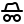

<p align="center">
  
</p>

## Quick start

We use docker. You can run it without but it's not recommended.

```bash
cp .env.example .env # and fill them in obviously
docker compose up -d --build
```

## Stack

- Go
- SQLite
- Cloudflare R2 (optional)
- Docker

## Features

- Anonymous uploads
- No persisted IP logging
- File deletion via cryptographic tokens
- Optional file expiration
- Direct-to-R2 uploads via presigned URLs (faster uploads through the webui)
- Archive previews with tree navigation
- CLI tool
- ShareX support

## CLI

```bash
curl https://anonhost.cc/install | bash
anonhost.sh upload image.png
anonhost.sh upload secret.txt --encrypt   # encrypted; key is appended to the URL fragment
```

## Roadmap

See [roadmap](https://anonhost.cc/roadmap) for planned improvements.

## License

MIT
